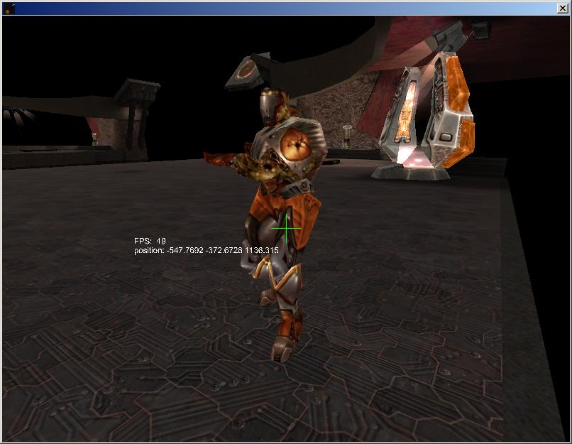

<div align="center">

## opengl quake 3 bsp viewer


</div>

### Description

my code demonstrates the posibilities of quake3 style graphics in vb
 
### More Info
 
w s a d -> flying around

v -> view mode

t -> turn on/off textures

l -> turn on/off lighting

it might be buggy, if you find a bug, please report it to me so i can fix it.

it renders a bsp

might be buggy and probably gives a low FPS and is not recommended for low spec computers


<span>             |<span>
---                |---
**Submitted On**   |2003-03-17 21:33:42
**By**             |[Rene Kersten](https://github.com/Planet-Source-Code/PSCIndex/blob/master/ByAuthor/rene-kersten.md)
**Level**          |Advanced
**User Rating**    |4.7 (14 globes from 3 users)
**Compatibility**  |VB 6\.0
**Category**       |[Graphics](https://github.com/Planet-Source-Code/PSCIndex/blob/master/ByCategory/graphics__1-46.md)
**World**          |[Visual Basic](https://github.com/Planet-Source-Code/PSCIndex/blob/master/ByWorld/visual-basic.md)
**Archive File**   |[opengl\_qua1580984292003\.zip](https://github.com/Planet-Source-Code/rene-kersten-opengl-quake-3-bsp-viewer__1-45125/archive/master.zip)

### API Declarations

```
about 800 lines of opengl api declaration (Thanks to W-Buffer)
some other apis for mouse/keyboard input and some other generic apis
```


